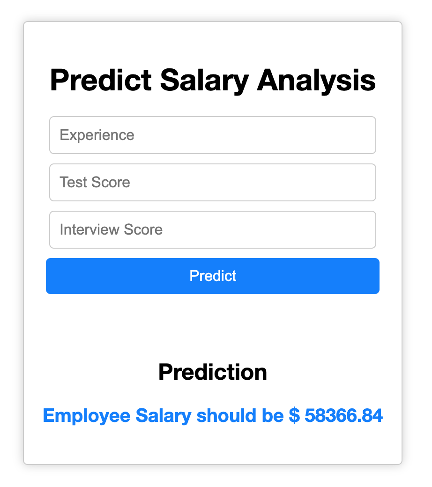

# Employee Salary Prediction 
## Using Machine Learning, deployment on Render

This is a machine learning project to predict employee salaries based on their years of experience, test score, and interview score. The project uses a Flask web application to create a user interface where users can input employee information, and the application will output the predicted salary.

The code loads a CSV dataset and performs feature engineering to replace null values with appropriate data. It then converts textual data to numerical data and uses linear regression to train a model to predict employee salaries based on features like experience, education, and test scores. 

The model is saved as a pickle file and can be loaded and used for predictions.


## Demo
A demo of this application is available on [Render](https://salarypredict.onrender.com/).



## Dependencies
The project requires the following dependencies:

Python 3

Flask

NumPy

scikit-learn

The dependencies can be installed using pip:

```
  pip install flask numpy scikit-learn
```

## Usage
To use the application, clone the repository and run the app.py file using Python:

```
  git clone https://github.com/username/repo.git
  cd repo
  python app.py
```
  
The application will start running on http://localhost:5000/. You can access the user interface by opening a web browser and navigating to http://localhost:5000/.

## Model
The machine learning model used in this project is trained using scikit-learn and saved as a pickle file model.pkl. The model takes in inputs such as years of experience, test score, and interview score, and predicts the salary of the employee.

## Credits
The project is based on a class taught by [Dr. Yasser Almehio](https://github.com/mymehio/).
